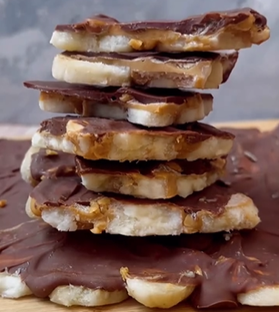

1. Coloca las rodajas de plátano sobre una tabla o bandeja forrada con papel de horno o papel encerado.
2. Añade la mantequilla de cacahuete, luego los frutos secos (por ejemplo, cacahuetes, almendras, pistachos,...) por encima, y finalmente el chocolate derretido.
3. Puedes espolvorear algo de sal o más frutos secos por encima como decoración.
4. Congela durante al menos 1 hora.
5. Corta en trozos.

## Conservación
Guarda en el congelador en un recipiente hermético o en una bolsa de plástico. ¡Dura de 3 a 4 meses!

---

_Adaptación de [Instagram @laverdudegabi](https://www.instagram.com/reel/C4T71UHL9nk/?utm_source=ig_web_copy_link&igsh=MzRlODBiNWFlZA==)._

