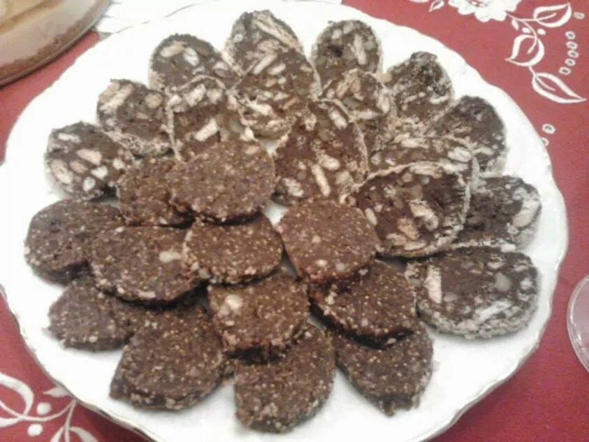

1. **Melt the chocolate**: In a double boiler or microwave, melt the dark chocolate with the butter, stirring occasionally until smooth. Let it cool slightly.
2. **Add the dry ingredients**: Stir in the crushed cookies and chopped nuts until everything is well combined.
3. **Shape the "morcilla"**: Place the mixture on a piece of plastic wrap or parchment paper. Shape it into a log (like a morcilla), wrapping it tightly.
4. **Chill:** Place the log in the refrigerator for at least 2 hours, or until it becomes firm.
5. **Serve:** Once chilled and firm, remove the plastic wrap, and if desired, dust with powdered sugar to mimic the appearance of a real morcilla. Slice and serve!

---

_Adaptation from [Eva Arguiñano](https://www.hogarmania.com/cocina/recetas/postres/morcilla-dulce-40095.html)._

_Similar recipes:_

- _[Instagram @ugar90](https://www.instagram.com/reel/C0q84blrvYL/?utm_source=ig_web_copy_link)_

