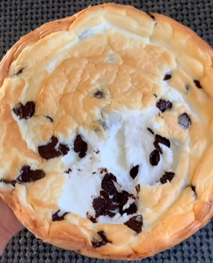

1. **Preparar la masa:** En una batidora de pie, combina el polvo de clara de huevo y el agua. Bate hasta que se formen picos firmes.
2. **Mezclar los ingredientes:** Incorpora suavemente el yogur griego, con cuidado de no mezclar en exceso. Añade las chispas de chocolate y mezcla hasta que estén apenas combinadas.
3. **Hornear:** Transfiere la masa a un molde para hornear engrasado. Hornea en un horno precalentado a 180°C (350°F) durante unos 30 minutos, o hasta que la parte superior esté dorada.
4. **Enfriar y servir:** Deja enfriar ligeramente. Es posible que se desinfle un poco, lo cual es normal. Arranca o corta un trozo y tuéstalo para un delicioso bocado.

---

_De [Instagram @your.keto.buddy](https://www.instagram.com/reel/C-9_ezySGAH/?utm_source=ig_web_copy_link&igsh=MzRlODBiNWFlZA==)._

