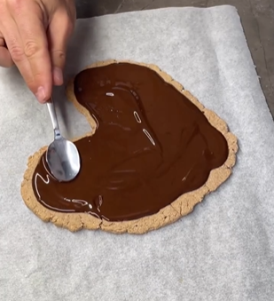

1. Mezcla la avena molida con el yogur usando un batidor o licuadora.
2. Extiende la mezcla sobre papel de hornear, dándole forma de corazón.
3. Hornea durante 12 minutos a 180°C (356°F), dándole la vuelta a la mitad del tiempo.
4. Derrite el chocolate o el cacao en polvo y cubre el hojaldre.
5. Deja enfriar y luego refrigera en la nevera.

---

_De [Instagram @fitfoodmania](https://www.instagram.com/reel/Crq7IehIx_h/?utm_source=ig_web_copy_link&igsh=MzRlODBiNWFlZA==)._

