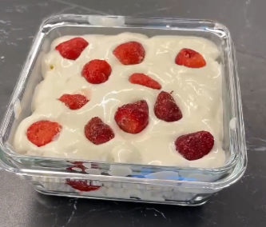

1.  **Prepara la base de tortitas de arroz:** En un bol, **machaca las tortitas de arroz inflado** hasta obtener migas. Si quieres una base más compacta, puedes añadir un chorrito de leche o bebida vegetal para humedecer ligeramente las migas y que se compacten mejor.

2.  **Forma la base:** En un plato o molde (puedes usar un aro de emplatar para darle forma), presiona las migas de tortita de arroz machacadas en el fondo para crear una base uniforme y compacta para la tarta.

3.  **Prepara el relleno cremoso:** En otro bol, mezcla el **yogur griego light**, el **queso de untar light** y el **scoop de proteína en polvo**. Bate bien hasta obtener una crema homogénea y sin grumos.

4.  **Monta la tarta:** Vierte el relleno cremoso sobre la base de tortitas de arroz en el molde o plato. Extiéndelo uniformemente con una espátula.

5.  **Añade fruta y decora:** Decora la parte superior de la tarta con la **fruta elegida**. Puedes colocarla de forma decorativa o esparcirla por encima.

6.  **Enfría:** Cubre la tarta con film transparente (o introdúcela en un recipiente hermético) y refrigera en la nevera durante al menos **4 horas**, o idealmente toda la noche, para que el relleno se asiente y la tarta adquiera una consistencia firme.

7.  **Sirve:** Una vez que la tarta esté firme y bien fría, retírala de la nevera (si usaste un aro, desmóldala con cuidado) y sírvela.

---

_Adaptado de [Instagram @marioortiznutricion](https://www.instagram.com/reel/DMnzfbwIxe9/?utm_source=ig_web_copy_link)._

