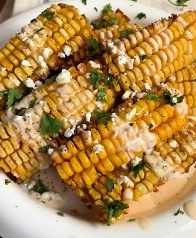

1.  **Prepara las mazorcas:** Coloca las **mazorcas crudas** de pie sobre una tabla de cortar. Con un cuchillo grande y afilado, corta la mazorca a lo largo, de manera que la partas en cuatro "costillas" o "ribs". Repite con todas las mazorcas.

2.  **Prepara el aderezo:** En un bol grande, mezcla la **mantequilla derretida** con el **ajo en polvo**, la **paprika**, la **sal** y la **pimienta**.

3.  **Cubre las costillas de maíz:** Agrega las "costillas" de maíz al bol y mézclalas bien para que queden cubiertas uniformemente con la mantequilla y las especias.

4.  **Cocina en la freidora de aire:** Coloca las **cornribs** en la canasta de la freidora de aire, asegurándote de que no se amontonen. Cocina a **180°C** durante **15 minutos**, o hasta que estén doradas y tiernas, y se hayan curvado ligeramente.

5.  **Prepara la salsa final (opcional):** Mientras se cocinan, en un tazón pequeño, mezcla la **mayonesa artesanal** con el **jugo de limón** y la **salsa picante** (si la usas).

6.  **Sirve y decora:** Retira las cornribs de la freidora de aire. Sírvelas inmediatamente, rociando por encima la salsa de mayonesa, el **cilantro picado** y el **queso fresco desmenuzado**.

---

_Adaptado de [Instagram @caligourmet](https://www.instagram.com/reel/DDzgaZypwTH/?utm_source=ig_web_copy_link)._

