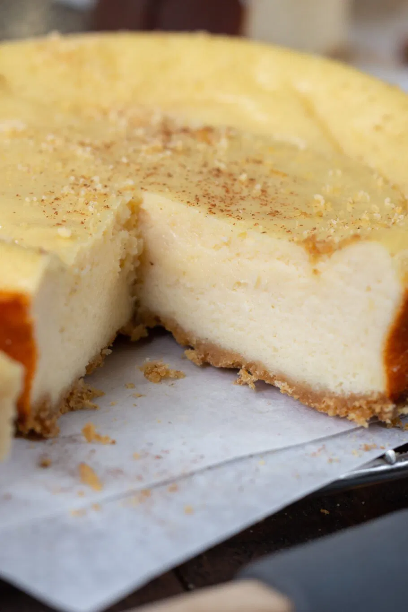

1. Agrega todos los ingredientes para el pastel de queso en un procesador de alimentos o licuadora.
2. Procesa o licúa todo hasta obtener una mezcla suave.
3. Vierte la mezcla en el molde para el pastel de queso.
4. Hornea a 160°C (325°F) durante unos 20-25 minutos.
5. Deja enfriar, envuélvelo y ponlo en el refrigerador durante unas horas.

---

_Adaptación de [The Protein Chef](https://theproteinchef.co/easy-cottage-cheese-cheesecake-recipe/)._

