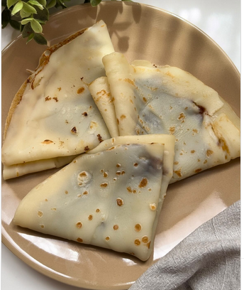

1.  **Prepara la masa:** En un bol, bate el **huevo** con la **leche o bebida vegetal**. Añade la **sal** y el **azúcar** y mezcla bien hasta que se integren.

2.  **Añade la harina:** Incorpora la **harina** gradualmente, batiendo con unas varillas. Sigue añadiendo harina hasta que la mezcla tenga la consistencia de unas **natillas líquidas**, es decir, que sea lo suficientemente fluida para extenderse fácilmente en la sartén.

3.  **Deja reposar (opcional):** Si tienes tiempo, deja reposar la masa en el frigorífico durante unos 15-20 minutos. Esto ayuda a que las burbujas desaparezcan y la masa quede más elástica.

4.  **Cocina los crepes:** Calienta una sartén antiadherente a fuego medio. Úntala con un poco de **mantequilla o aceite**. Vierte una pequeña cantidad de masa, girando la sartén para que la masa cubra toda la base en una capa fina.

5.  **Da la vuelta:** Cocina durante 1-2 minutos o hasta que los bordes se doren. Con una espátula, dale la vuelta al crepe y cocina el otro lado por 1 minuto más.

6.  **Sirve:** Repite el proceso con el resto de la masa. Sirve los crepes calientes, rellenos con tus ingredientes favoritos, ya sean dulces (mermelada, Nutella, nata, fruta) o salados (jamón, queso, etc.).

---

_Adaptado de [Instagram @sabrina_abate](https://www.instagram.com/reel/C7v8qycoBUp/?utm_source=ig_web_copy_link)._

