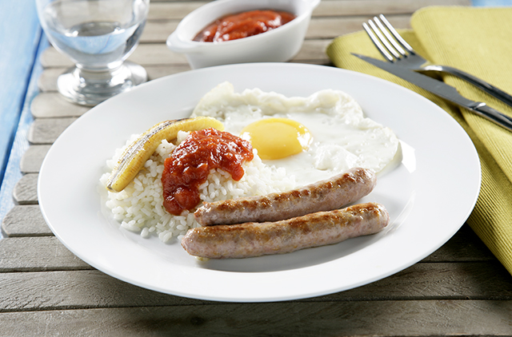

For 2 servings.

1. **Cook the rice:** In a pot, bring water to a boil, add a pinch of salt, and cook the rice for about 15-20 minutes, or until tender. Drain and set aside.
2. **Sauté garlic and rice:** In a pan, heat a little olive oil and sauté the minced garlic until fragrant. Add the cooked rice, stir for a few minutes to infuse the garlic flavor, then set aside.
3. **Fry the sausages (optional):** In the same pan, fry the sausages until browned. Set aside. The sausages can also be cooked in the oven or on a grill.
4. **Fry the bananas:** Peel the bananas and cut them in half lengthwise. Fry them in the pan with olive oil until golden on both sides. Remove and drain on paper towels.
5. **Fry the eggs:** In the same pan, fry the eggs sunny-side up to your preference.
6. **Heat the tomato sauce:** Warm the tomato sauce in a small saucepan, or combine with the rice in step 2.
7. **Assemble:** On each plate, place a portion of the garlic-infused rice, the fried banana, sausage, and fried egg. Pour the warm tomato sauce over the rice.

---

_Adaptation from [Arroz SOS](https://www.arrozsos.es/recetas/arroz-a-la-cubana/)._

