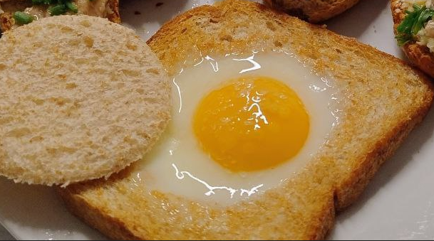

1. **Haz un agujero en el pan:** Usa un cortador de galletas redondo o el borde de un vaso para cortar un agujero en el centro de la rebanada de pan (alrededor de 5-7 cm de diámetro). Guarda el trozo de pan recortado para usarlo más tarde si deseas tostarlo por separado.
2. **Calienta una sartén** a fuego medio y agrega la mantequilla o el aceite, permitiendo que se derrita y cubra la sartén.
3. **Coloca la rebanada de pan** en la sartén, luego rompe el huevo y colócalo en el agujero del pan.
4. **Cocina el huevo:** Deja que el huevo se cocine hasta que la clara esté firme y la yema aún esté líquida, aproximadamente 2-3 minutos. Si prefieres la yema completamente cocida, cubre la sartén con una tapa por un minuto para ayudar a que se cocine bien.
5. **Sazona:** Espolvorea con sal y pimienta al gusto.
6. **Opcional:** Tuesta el trozo de pan que retiraste antes en la sartén o úsalo para mojar.

---

