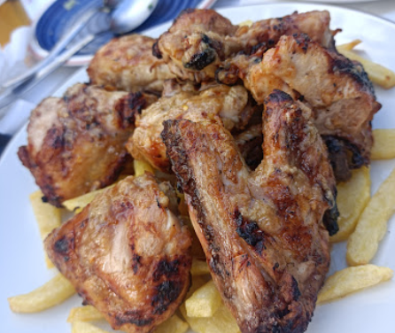

## Para la salsa Peri Peri (opcional)
- 1-4 guindillas peri peri, o las que tengas (ajusta la cantidad según el nivel de picante deseado)
- 1 cucharadita de azúcar moreno
- 3 dientes de ajo
- 2 cucharaditas de pimentón dulce/picante
- Aceite de oliva virgen extra
- Un poco de jengibre fresco
- Pimienta negra molida
- Sal
- Orégano seco
- 1 cucharadita de salsa de soja
- 40 ml de vinagre blanco (o de vino)
- 2 cucharaditas de jugo de limón

## Instrucciones
1. **Preparar el pollo:** Limpia el pollo y córtalo en piezas (muslos, pechugas, alas, etc.). También puedes asarlo entero si prefieres.
2. **Marinar el pollo:** Pela y machaca los dientes de ajo con el aceite de oliva, el jugo de limón y la sal, y frota toda la mezcla por el pollo. Cúbrelo y déjalo en la nevera durante al menos 1 hora (o preferiblemente durante la noche en la nevera ~ 12 horas).
3. **Preparar la salsa peri peri (opcional):** Mezcla todos los ingredientes de la salsa peri peri, excepto el aceite (primero retira los tallos y las semillas de las guindillas). Una vez todo bien mezclado, agrega la cantidad necesaria de aceite de oliva y remueve bien. Reserva.
4. **Cocinar:** Precalienta el horno a 200°C (390°F) y coloca el pollo en una fuente apta para horno. Vierte medio vaso de agua en el fondo y hornea durante 30 minutos. Da la vuelta al pollo a la mitad de la cocción para que se cocine de manera uniforme. Después de este tiempo, retira el pollo del horno y cúbrelo completamente con la salsa peri peri. Enciende el grill y dora completamente el pollo (idealmente, termínalo en una parrilla de carbón).

---

_De [Taberna Heliópolis](https://maps.app.goo.gl/3PA5jPJHGyjgPZQC6) y [Nando's](https://www.nandos.com/)_

_Recetas similares:_ 
- _[Directo al paladar](https://www.directoalpaladar.com/recetas-de-carnes-y-aves/receta-frango-piri-piri-pollo-al-carbon-asado-al-estilo-portugues)_
- _[20 minutos](https://www.20minutos.es/gastronomia/recetas/el-pueblo-de-portugal-conocido-como-la-capital-del-pollo-asi-es-su-receta-con-salsa-picante-5059820/)_
- _[El Comidista](https://elpais.com/gastronomia/recetas/2022/01/31/receta/1643623059_297177.html)_
- _[Instagram @vikikacosta](https://www.instagram.com/reel/Czl2Pu-NIjS/?utm_source=ig_web_copy_link)_

