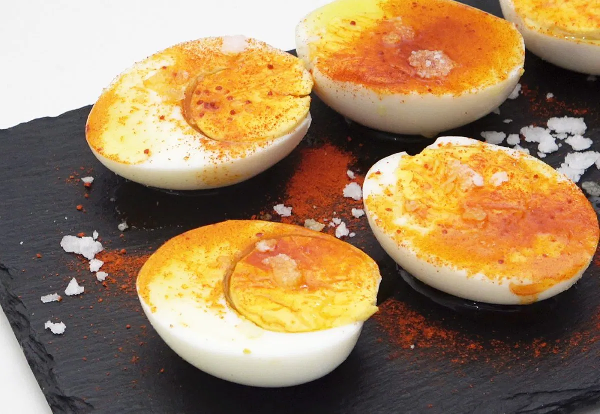

For 2 servings.

1. **Prepare the cold water**: Before starting the recipe, fill a bowl with lukewarm water (from the tap) and place it in the fridge, preferably in the coldest part. If you have ice at home, you can skip this step.
2. **Boil the eggs:** Bring a pot of water to a boil. Once boiling, add the eggs, salt to taste, and a dash of vinegar (optional) to help peel the eggs more easily later. Boil for 10 minutes once the water begins to bubble.
3. **Cool the eggs:** After boiling, transfer the eggs to the bowl of cold water (either from the fridge or with ice) to stop the cooking process. Let them sit for 5 minutes in the cold water.
4. **Peel and halve the eggs:** Once the eggs are cool, peel them and cut them in half.
5. **Plate and garnish:** Place the egg halves on a plate or serving tray. Drizzle with extra virgin olive oil, sprinkle with paprika, and finish with a pinch of flake salt.
   
---

_Adaptation from [Alfonso López Alonso @de Rechupete](https://www.abc.es/recetasderechupete/huevos-a-la-gallega-una-tapa-lista-en-15-minutos/93338/)._

