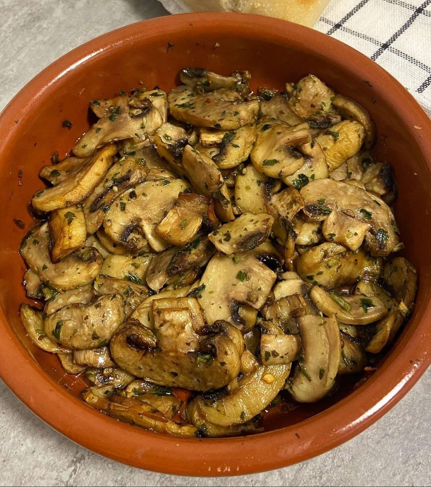

1. Lava y corta los champiñones en rodajas gruesas.
2. Mézclalos con el ajo, perejil, guindilla, aceite y sal.
3. Precalienta la freidora de aire.
4. Cocínalos a 190°C (375°F) durante 10 minutos (a mitad de cocción, abre la freidora y revuélvelos).

---

_Recetas similares:_

- _[Instagram @misrecetasairfryercosori](https://www.instagram.com/p/C1mSz6otO8m/?utm_source=ig_web_copy_link&igsh=MzRlODBiNWFlZA==)_
- _[Instagram @pilpileando_con_guille](https://www.instagram.com/reel/CrJn-fkPWip/?utm_source=ig_web_copy_link)_

