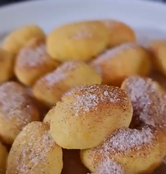

1.  **Prepara los ñoquis:** Coloca los **ñoquis** en un bol. Añade una **cucharadita de aceite de oliva virgen extra** y mezcla bien para que todos los ñoquis queden ligeramente cubiertos.

2.  **Cocina en la freidora de aire:** Transfiere los ñoquis a la cesta de la freidora de aire. Cocina a **190°C** durante **15 minutos**. A la mitad del tiempo (aproximadamente a los 7-8 minutos), agita la cesta para asegurar que se cocinen de manera uniforme y queden crujientes por todos lados.

3.  **Prepara la mezcla de churros:** Mientras se cocinan, en un tazón pequeño, mezcla el **eritritol** o el **coco rallado** y la **canela molida** en las proporciones que más te gusten (más eritritol para un sabor más dulce, más canela para un toque especiado).

4.  **Sirve y cubre:** Saca los ñoquis calientes de la freidora de aire. Pásalos al tazón con la mezcla de eritritol y canela. Mezcla bien para que queden completamente rebozados. Sirve inmediatamente.

---

_Adaptación de [Instagram @maydenyt](https://www.instagram.com/reel/DHTEh32owRS/?utm_source=ig_web_copy_link)._

