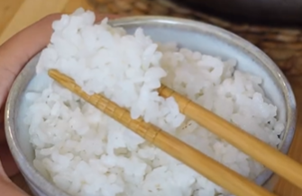

Usa arroz redondo o bomba (evita el arroz basmati o de grano largo).

1. Mide el arroz y colócalo en una olla.
2. Añade suficiente agua a la olla, revuelve rápidamente 2 o 3 veces y luego desecha el agua.
3. Añade agua nuevamente y lava el arroz a mano, repite este proceso 3-6 veces (o hasta que el agua salga clara), desechando el agua cada vez.
4. Añade la misma cantidad de agua al arroz lavado, cúbrelo con una tapa y, si tienes tiempo, te recomiendo dejarlo en remojo durante 30 minutos.
5. Coloca la olla a fuego medio y espera a que el agua en la olla comience a hervir (escucharás sonidos de burbujeas o verás espuma desbordándose de la tapa).
6. Una vez que comience a hervir, cocina a fuego medio durante 2 minutos.
7. Luego, reduce el fuego a bajo y cocina durante 9 minutos adicionales. Finalmente, verifica que no quede agua dentro. Si no hay agua, el arroz está listo. Si necesitas abrir la tapa para verificarlo, recuerda volver a taparlo inmediatamente y calentar a fuego medio durante 5-10 segundos para recalentar la olla.
8. Después de cocinarlo, deja la tapa puesta durante 10 minutos sin abrirla para que el arroz se siga cocinando al vapor. Esto asegura que el arroz se cocine de manera uniforme y quede esponjoso.
9. Después de vaporizar, abre la tapa y mezcla suavemente el arroz desde el fondo con una espátula para que quede esponjoso.

---

_De [Instagram @yamamotokitchen](https://www.instagram.com/reel/C6br4_wqA67/?utm_source=ig_web_copy_link&igsh=MzRlODBiNWFlZA==)._

