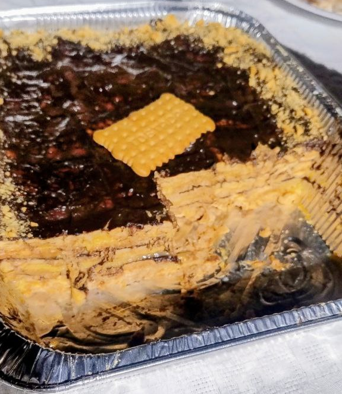

1.  **Prepara las natillas:** En un cazo, vierte 1 litro de **leche**. Reserva un vaso de leche fría. Calienta el resto de la leche a fuego medio. En el vaso de leche fría, disuelve los **2 sobres de natillas** y el **azúcar** al gusto. Cuando la leche del cazo esté caliente (sin que hierva), vierte la mezcla del vaso sin dejar de remover con unas varillas hasta que espese. Retira del fuego y reserva.

2.  **Prepara el chocolate a la taza:** En otro cazo, calienta el **medio litro de leche** restante a fuego medio. Añade el **chocolate a la taza** y el **azúcar** al gusto. Remueve continuamente con unas varillas hasta que el chocolate se disuelva por completo y la mezcla adquiera la consistencia deseada. Retira del fuego y reserva.

3.  **Monta la tarta:** Elige una fuente o molde rectangular. Moja ligeramente las **galletas tostadas** en leche (puedes usar un poco de la leche sobrante si es necesario, sin azúcar) y coloca una primera capa en la base del molde.

4.  **Alterna las capas:**
    * Sobre la capa de galletas, vierte una capa de natillas y extiéndela uniformemente.
    * Coloca otra capa de galletas mojadas.
    * Sobre las galletas, vierte una capa de chocolate a la taza y extiéndela.
    * Continúa alternando capas de galletas con natillas y chocolate hasta agotar los ingredientes, terminando siempre con una capa de chocolate.

5.  **Enfría y decora:** Una vez montada la tarta, deja que se temple a temperatura ambiente y luego métela en el frigorífico. Deja que repose y se asiente durante al menos **2 horas**, o idealmente toda la noche. Si quieres, antes de servir puedes decorar la parte superior con virutas de chocolate o fideos de colores.

---

