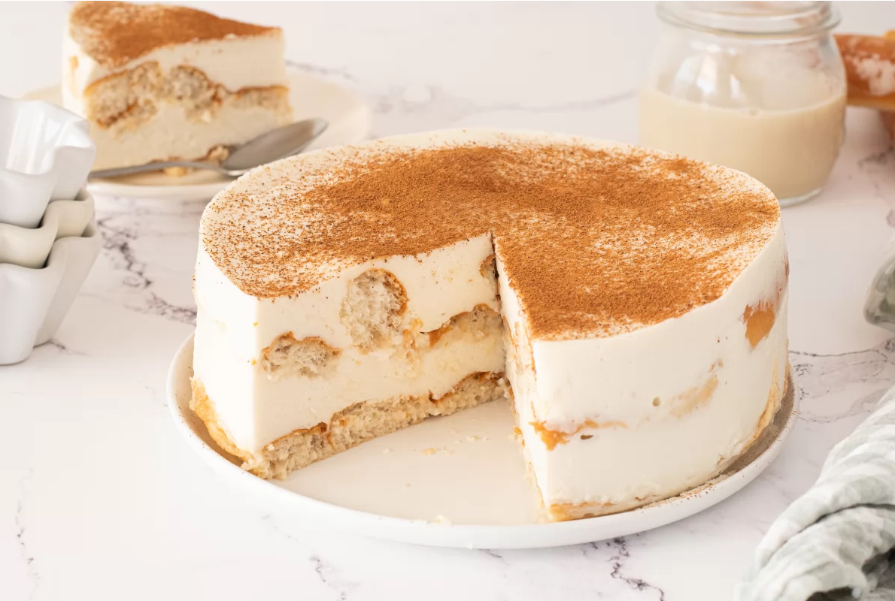

1. Mezcla 400 ml de horchata con la maicena y caliéntala a fuego medio sin dejar de remover hasta que espese. Reserva los 200 ml restantes de horchata para remojar los fartons.
2. Hidrata las hojas de gelatina en agua fría.
3. Escurre la gelatina y añádela a la crema de horchata espesa. Pasa esta mezcla a un bol, cúbrelo con film y deja enfriar a temperatura ambiente.
4. Bate la nata muy fría con el azúcar glas hasta que esté semimontada.
5. Incorpora la crema de horchata ya fría con movimientos envolventes para mantener la mezcla aireada.
6. Parte los fartons por la mitad longitudinalmente, mójalos ligeramente en los 200 ml de horchata, escúrrelos y colócalos en la base de un aro de 18 cm sobre el plato.
7. Vierte la mitad de la crema sobre los fartons y alisa la superficie.
8. Coloca la segunda capa de fartons remojados y cúbrelos con el resto de la crema. Alisa la superficie.
9. Refrigera al menos 8 horas, idealmente de un día para otro.
10. Al día siguiente, retira el aro y espolvorea canela en polvo al gusto.
11. Sirve bien fría y disfruta de esta tarta ligera y refrescante.

---

_De [Marina Corma @ Bon Viveur](https://www.bonviveur.es/recetas/tarta-de-horchata-y-fartons)._

