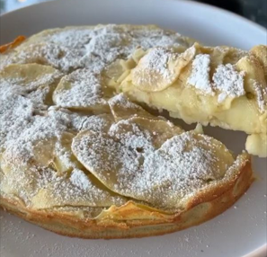

## Preparación
1. Pela las manzanas y córtalas en rodajas muy finas.
2. En un bol, mezcla la harina, el azúcar, la levadura en polvo, el aceite, los huevos y la leche. Mezcla hasta obtener una masa suave.
3. Incorpora suavemente las rodajas de manzana.
4. Engrasa y enharina un molde para hornear y vierte la mezcla en el molde.
5. Hornea a 180°C (350°F) hasta que esté dorado, aproximadamente 30-40 minutos.
6. Una vez enfriado, espolvorea con azúcar glas o canela para decorar.

## Información
**Unsichtbare Apfelkuchen (Pastel invisible de manzana)** es un postre alemán único que presenta un gran volumen de manzanas finamente cortadas, combinadas con suficiente masa ligera para mantener la forma del pastel después de hornearlo. El nombre "invisible" proviene de la forma en que las manzanas parecen desaparecer en la masa durante el horneado, creando un pastel visualmente impactante y delicadamente estratificado. El resultado es un pastel donde las manzanas son las protagonistas, proporcionando una textura suave y tierna, con un sabor naturalmente dulce, mientras que la masa fina sirve para unir las manzanas sin opacarlas. Este pastel es sorprendentemente diferente de los pasteles tradicionales de manzana debido a su énfasis en la fruta, lo que lo convierte en un postre visualmente atractivo y deliciosamente ligero.

---

_Adaptación de [Instagram @recetassaludables_sanas_](https://www.instagram.com/p/C6OTyuzg42l/?utm_source=ig_web_copy_link&igsh=MzRlODBiNWFlZA==)._

