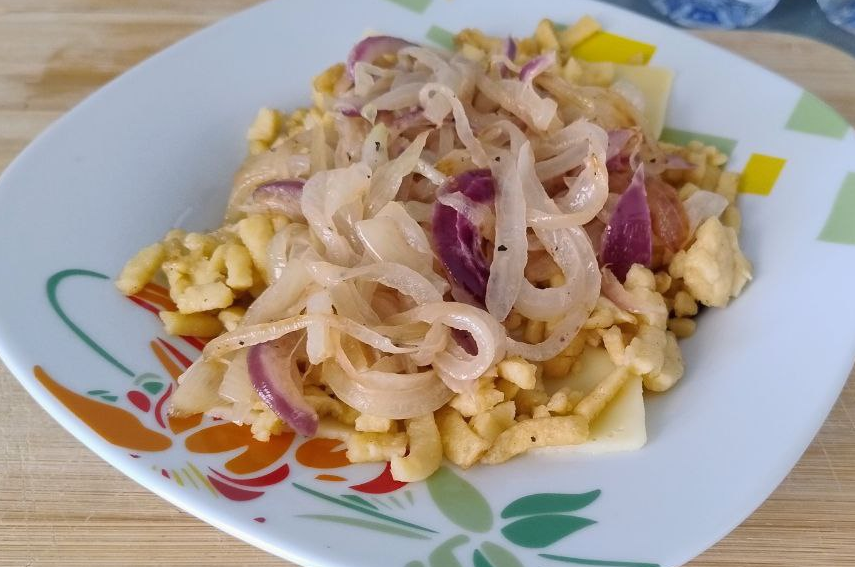

Para **1 ración abundante**.

1.  **Preparar la masa de Spätzle:** En un bol, mezcla la **harina**, **sal** y **nuez moscada**. Añade el **huevo** y la **leche**. Bate vigorosamente con una cuchara de madera o batidora durante 5 minutos. La masa debe ser espesa y pegajosa, formando burbujas de aire. Deja reposar la masa durante **15 minutos**.

2.  **Hacer las Röstzwiebeln (Cebollas Fritas):** Corta la **media cebolla** en aros finos. En una sartén, derrite media cucharada de **mantequilla** a fuego medio. Fríe los aros de cebolla lentamente hasta que estén **dorados y crujientes** (puedes pasarlos por un poco de harina para más crujiente). Retira y reserva sobre papel de cocina.

3.  **Cocer los Spätzle:** Pon abundante agua salada a hervir. Usando un rallador de Spätzle o un colador de agujeros grandes, presiona la masa para que caiga en el agua. Retira los Spätzle inmediatamente cuando **floten a la superficie** y escúrrelos bien.

4.  **Montaje y Fusión:** Derrite la mantequilla restante en una sartén grande. Agrega los Spätzle cocidos y saltéalos para calentar. Reduce el fuego al mínimo. Agrega la mezcla de **quesos rallados** y remueve constantemente hasta que el queso se haya derretido por completo y la pasta esté elástica y bien cubierta. Sazona con pimienta.

5.  **Servir:** Sirve el **Käsespätzle** inmediatamente, cúbrelo con las **Röstzwiebeln** crujientes y espolvorea con **cebollino fresco** picado.

_Sirve tradicionalmente con una ensalada verde o ensalada de patatas._

---

