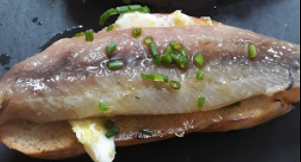

1. **Preparar las sardinas:** Limpia y filetea las sardinas, retirando las espinas y la piel, de manera similar a como se preparan las anchoas. Enfríalas en el refrigerador.
2. **Hacer la mantequilla de limón:** En un bol pequeño, mezcla la mantequilla blanda con el jugo y la ralladura de limón. Remueve hasta que quede suave.
3. **Tostar el pan:** Tuesta la rebanada de pan hasta que esté dorada y crujiente.
4. **Untar la mantequilla:** Unta la mantequilla de limón de manera uniforme sobre el pan tostado.
5. **Agregar las sardinas:** Coloca las sardinas fileteadas sobre el pan con mantequilla.
6. **Decorar:** Espolvorea cebollino fresco picado por encima y sazona con sal al gusto.
7. **Servir:** Sirve inmediatamente como aperitivo o merienda deliciosa.
---

_De [En k' lola](https://maps.app.goo.gl/cjGVcjpy3enL2CSr9)._

