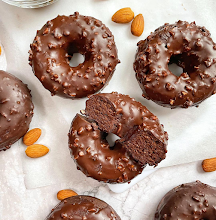

Cantidades para 28 pequeños donuts.

1. Tritura todos los ingredientes.
  
2. Divide la mezcla en un molde para donuts y hornea a 180°C (350°F) durante 18 minutos; o durante 5 minutos en una máquina para donuts.

3. (Opcional) Deja enfriar y decora con chocolate negro derretido mezclado con trozos de almendra.

---

_De [Instagram @marisel.orozco](https://www.instagram.com/p/Ck8Z8h-DhS1/?igshid=MzRlODBiNWFlZA==)._

