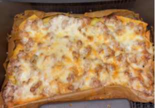

Las papas cargadas son un platillo compuesto por papas fritas cubiertas con una combinación de queso, salsas, carne (comúnmente tocino) y vegetales.

Ingredientes para 1 porción.

1. **Prepara las papas:** Corta las papas en tiras. Precalienta el horno a 200°C (400°F) o calienta el aceite en una sartén.
2. **Cocina las papas:** Si horneas, mezcla las papas con un poco de aceite de oliva y distribúyelas en una bandeja para hornear. Hornea durante 25-30 minutos, dándoles la vuelta a mitad de tiempo hasta que estén doradas y crujientes. Si las fríes, fríelas en lotes hasta que estén crujientes y escúrrelas en toallas de papel.
3. **Prepara la carne:** Si usas carne picada, sazona la carne con sal, pimienta y tus especias favoritas (por ejemplo, Cajún), luego fríela en una sartén o incorpórala a las papas y hornéala durante 5 minutos adicionales a 190°C (375°F).
4. **Sazona:** Mientras las papas estén calientes, sazónalas con sal y pimienta.
5. **Añade los ingredientes:** Coloca las papas en un plato para servir. Esparce el queso rallado sobre las papas, luego añade el tocino desmenuzado y el cebollín.
6. **Derrite el queso:** (Opcional) Vuelve a meter las papas al horno por un par de minutos (2) hasta que el queso se derrita.
7. **Sirve:** Rocía con crema agria y añade los ingredientes adicionales que te gusten, como jalapeños, guacamole, salsa, cebollas fritas, cebollín picado, etc.

---

_De [Instagram @latoneira](https://www.instagram.com/reel/DBMVyumOHlI/?utm_source=ig_web_copy_link&igsh=MzRlODBiNWFlZA==)._

