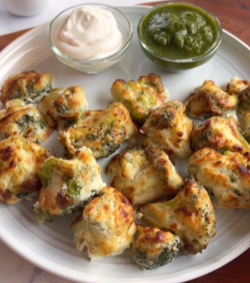

1. **Prepare the Cashew Paste:**
Soak the cashews in warm water for 20 minutes until softened. Drain and add them to a blender along with the cold water. Blend until smooth and creamy, forming a thick cashew paste. Set aside.

2. **Prepare the Broccoli:**
Blanch the broccoli florets in boiling salted water for 2 minutes. Transfer immediately to ice water for 2-3 minutes to stop cooking. Drain and gently squeeze out excess water.

3. **Marinate:** 
In a bowl, whisk together the hung curd, malai, black salt, cardamom powder, white pepper, cashew paste, ginger paste, and oil until smooth. Add the broccoli florets and coat evenly. Let the broccoli marinate for 30-45 minutes.

4. **Cook:**
Preheat the air fryer to 200°C. Brush the marinated broccoli lightly with oil. Air fry for 10-15 minutes or until golden and slightly crispy. Alternatively, bake at 200°C for 15 minutes or pan-fry with a drizzle of oil until golden.

5. **Serve:**
Enjoy hot with your favorite dip or chutney.

---

_From [Instagram @bliss_is_food](https://www.instagram.com/reel/DCn5fRiI_St/?utm_source=ig_web_copy_link&igsh=MzRlODBiNWFlZA==)._

