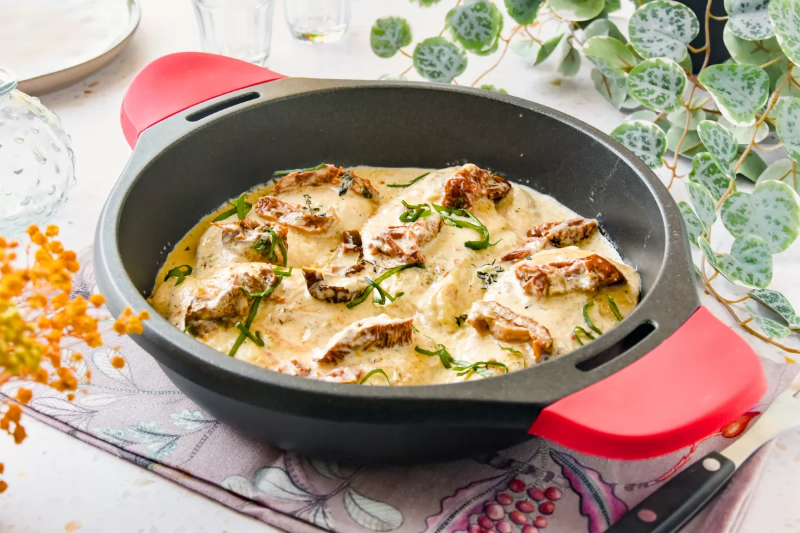

1.  **Prepara y sella el pollo:** Sazona los **muslos de pollo** (o pechugas) con sal y pimienta negra al gusto. Calienta 1 cucharada de **aceite de oliva virgen extra** en una sartén grande a fuego medio-alto. Sella el pollo por ambos lados hasta que esté dorado y cocido por completo (aproximadamente 6-8 minutos por cada lado, dependiendo del grosor). Retira el pollo de la sartén y resérvalo.

2.  **Prepara la base de la salsa:** En la misma sartén, sin limpiarla, añade si es necesario 1 cucharada más de aceite de oliva. Sofríe la **cebolla picada** a fuego medio durante 3-4 minutos, hasta que esté tierna. Añade los **dientes de ajo picados** y sofríe por 1 minuto más, hasta que estén fragantes.

3.  **Añade tomates secos y caldo:** Incorpora los **tomates secos picados** a la sartén. Vierte el **caldo de pollo** y deja que hierva a fuego lento durante 2-3 minutos, rascando el fondo de la sartén para despegar cualquier resto.

4.  **Incorpora la nata y el queso:** Reduce el fuego a medio-bajo. Añade la **nata para cocinar**, el **queso parmesano rallado**, el **orégano seco** y los **copos de chile** (si los usas). Remueve bien y cocina a fuego lento, sin dejar que hierva a borbotones, hasta que la salsa espese ligeramente (unos 5-7 minutos). Prueba y ajusta la sal y la pimienta si es necesario.

5.  **Reincorpora el pollo:** Vuelve a colocar el pollo cocido en la sartén con la salsa. Cúbrelo bien con la salsa y deja que se caliente durante 2-3 minutos.

6.  **Sirve:** Retira la sartén del fuego. Sirve el **Marry Me Chicken** inmediatamente, decorando con un puñado de **hojas de albahaca fresca picada** por encima. Combina muy bien con pasta, arroz o puré de patatas.

---

_De [Bonviveur.es](https://www.bonviveur.es/recetas/marry-me-chicken)._

