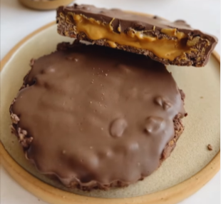

Para 2 pequeñas tartaletas.

1. Combina los cornflakes con el chocolate derretido.
2. Presiona la mezcla firmemente en dos moldes pequeños para tartaletas previamente engrasados para formar la base.
3. Refrigera durante 20 minutos.
4. Rellena las tartaletas con mantequilla de cacahuete y espolvorea las nueces troceadas por encima.
5. Finalmente, cubre con más chocolate derretido (usa la cantidad de chocolate que necesites).
6. Déjalas enfriar en la nevera.

---

_De [Instagram @levartenutricion](https://www.instagram.com/reel/C7982TBvhGE/?utm_source=ig_web_copy_link&igsh=MzRlODBiNWFlZA==)._

