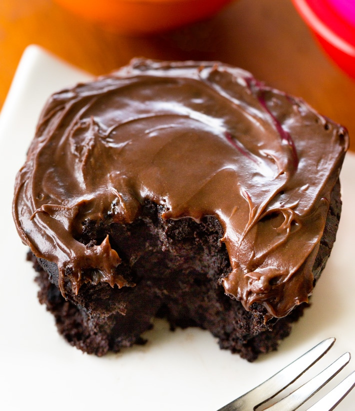

Para 1 porción.

## Consejos
- Si usas mantequilla sin sal, añade 1/8 cucharadita de sal.
- Puedes sustituir la mantequilla por aceite (2-3 cucharaditas) o plátano triturado.
- Si deseas una porción más grande, simplemente duplica la receta y cocínala en un recipiente apto para microondas de tamaño mediano, convirtiendo esta receta en un **pastel en bol**.

## Preparación
1. En una taza apta para microondas, derrite la mantequilla en el microondas durante unos 20-30 segundos.
2. Mezcla bien todos los ingredientes secos hasta que estén bien combinados.
3. Añade los ingredientes líquidos, asegurándote de que la masa quede suave y sin grumos.
4. Cocina la mezcla en el microondas a máxima potencia durante 60-90 segundos, dependiendo de la potencia de tu microondas.
5. (Opcional) Añade tu glaseado o cobertura favorita si lo deseas.

---

_Adaptación de [Chocolate Covered Katie](https://chocolatecoveredkatie.com/chocolate-mug-cake-recipe/)._

