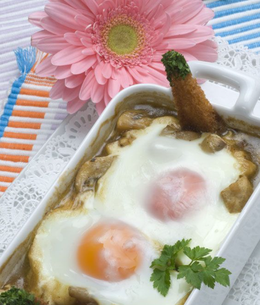

Ingredientes para 2 raciones.

1. Pelar y picar los dientes de ajo y sofreírlos en una cazuela con un chorrito de aceite.
2. Pelar y picar la cebolla, añadirla a la cazuela y dejar que se ablande.
3. Salpimentar y añadir las guindillas secas.
4. Incorporar la harina y cocinarla.
5. Verter el vino y añadir las setas limpias y troceadas.
6. Salpimentar y cocinar durante 12-15 minutos.
7. Retirar las guindillas y llenar 2 ramequines aptos para horno con la mezcla de setas.
8. Hacer uno o dos huecos en el centro y romper un huevo en cada hueco.
9. Hornear (en horno precalentado) a 220°C durante 4-5 minutos.
10. Decorar con las rebanadas de pan tostado con mantequilla untada y espolvorear con perejil picado.

---

_De [Karlos Arguiñano](https://www.hogarmania.com/cocina/recetas/setas-hongos/champinones-salsa-huevo-3303.html)._

