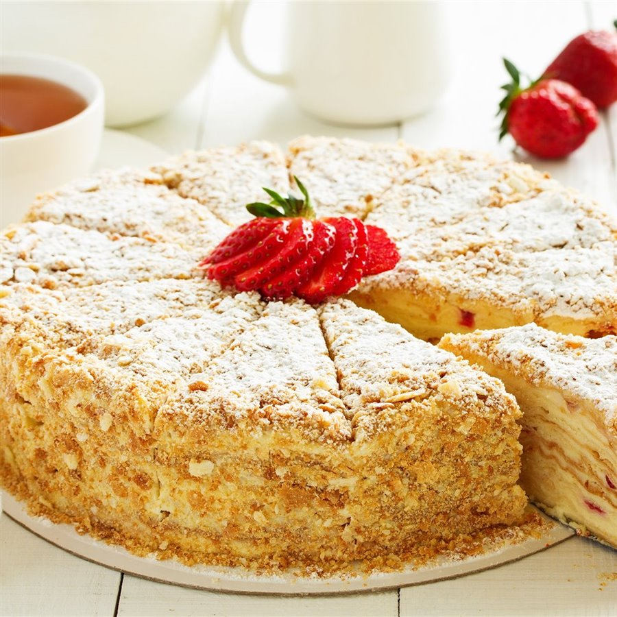

## Para las capas del pastel
- 450 gramos de harina
- 100 gramos de azúcar
- 25 gramos de mantequilla
- 3 huevos
- 1 cucharadita de polvo de hornear
- Una pizca de sal

## Para la crema pastelera
- 700 ml de leche
- 2 huevos
- 100 gramos de azúcar
- 1 cucharadita de azúcar vainillado
- 3 cucharadas de harina
- 100 gramos de mantequilla

## Preparación

### Preparar la masa para el pastel
1. Batir los huevos con el azúcar y una pizca de sal en un bol grande utilizando un batidor. Lo ideal es usar una batidora eléctrica, ya que necesitarás batir los huevos durante 3 minutos hasta que doblen su volumen.
2. Añadir la mantequilla y batir hasta que se incorpore completamente.
3. Agregar el polvo de hornear y mezclar antes de añadir la harina.
4. Amasar la mezcla hasta obtener una masa suave.
5. Formar una bola con la masa, envolverla en film transparente y dejarla reposar durante 20 minutos en el bol.

### Preparar la crema pastelera
1. Mezclar los huevos en una cacerola con el azúcar y la harina.
2. Remover hasta obtener una consistencia cremosa.
3. Añadir la leche y batir hasta obtener una crema ligera.
4. Colocar la cacerola a fuego lento y revolver con el batidor hasta que la crema espese.
5. Cubrir con film transparente y dejar enfriar a temperatura ambiente.
6. Batir los 100 gramos de mantequilla durante un par de minutos, añadir 2 cucharadas de crema pastelera, mezclar y luego añadir el resto de la crema pastelera.

### Preparar las capas del pastel
1. Dividir la masa en 9 partes y estirar cada una en forma de disco. Las capas deben ser finas para asegurar una cocción uniforme.
2. Cocinar los discos de masa en una sartén antiadherente durante 2 minutos por cada lado hasta que estén dorados.
3. Una vez cocidos los discos, recortar los bordes usando un bol al revés como guía, para que todas las capas sean del mismo tamaño.
4. Utilizar un procesador de alimentos para triturar todos los recortes de masa en migas finas que se usarán para la decoración del pastel.

### Montar la tarta
1. Colocar una capa de pastel en un plato grande y cubrirla con un par de cucharadas de crema pastelera, extendiéndola sobre toda la superficie.
2. Repetir el proceso hasta montar la tarta.
3. Cubrir toda la tarta con crema pastelera, extendiéndola por la superficie y los laterales, y espolvorear con las migas de pastel.
4. Dejar reposar en la nevera durante al menos 6 horas, y estará lista para servir.

---

_De [CocinaFácil](https://www.lecturas.com/recetas/actualidad/tarta-napoleon-irresistible-receta-rusa-milhojas-bizcocho-sin-horno_11736)._

