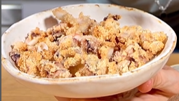

1. En un bol, mezclar la harina (o almendras molidas) con la sal, y remover bien. 
2. Añadir los calamares limpios y troceados, cubriéndolos bien con la mezcla.
3. Forrar la cesta de la freidora de aire con papel de hornear y disponer los calamares de manera uniforme. Rocíalos ligeramente con aceite de oliva.
4. Cocinar a 180°C (350°F) durante 12 minutos en la freidora de aire, o hornear en el horno a 180°C (350°F) durante 15 minutos.

---

_Adaptado de [Instagram @ugar90](https://www.instagram.com/reel/C5N10X1LelW/?utm_source=ig_web_copy_link&igsh=MzRlODBiNWFlZA==)._

