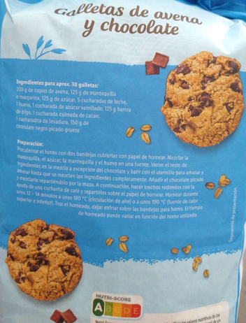

Puedes usar harina de trigo o cualquier otro tipo de harina. Incluso te recomiendo usar avena molida como harina, además de los copos de avena.

1. Precalienta el horno con dos bandejas de hornear cubiertas con papel pergamino.
2. Mezcla la mantequilla, el azúcar y el huevo en un bol.
3. Agrega los ingredientes restantes a la mezcla, excepto el chocolate, y mezcla con una herramienta para amasar hasta que estén completamente combinados.
4. Añade el chocolate picado e incorpóralo uniformemente en la masa.
5. Luego, usa una cuchara de café para formar pequeñas porciones redondas y colócalas en el papel pergamino.
6. Hornea durante unos 12-14 minutos a 180°C (356°F) (horno con ventilador) o 190°C (374°F) (calor arriba y abajo).
7. Después de hornear, deja que las galletas se enfríen en las bandejas de hornear.

---

_Adaptado de [Crownfield @Lidl](https://www.lidl.com/)._

