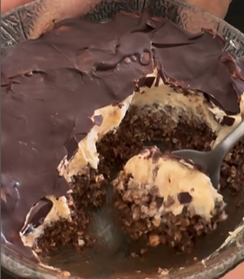

1. **Preparar la base:** En un bol, mezcla los copos de avena, el cacao en polvo, las semillas de chía y la leche.
2. **Preparar el mousse:** En un bol aparte, mezcla el queso crema con la mantequilla de maní y el extracto de vainilla hasta que quede suave.
3. **Montar:** Extiende la mezcla del mousse sobre la base de avena en el bol.
4. **Añadir la cobertura:** Vierte una capa de chocolate oscuro derretido al 85% sobre el mousse.
5. **Enfriar:** Colócalo en el congelador durante 5 minutos, o refrigéralo durante la noche para obtener mejores resultados.

---

_Adaptado de [Instagram @rochiiip_](https://www.instagram.com/reel/C7UniZrOgIp/?utm_source=ig_web_copy_link&igsh=MzRlODBiNWFlZA==)._

