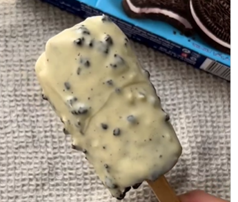

1. **Tritura las galletas:** Sin abrir el paquete de Oreo, tritura las galletas dentro hasta que se conviertan en migas finas.
2. **Añadir leche:** Abre ligeramente el paquete y vierte leche hasta llenarlo. Mezcla suavemente agitando.
3. **Insertar el palo:** Perfora el paquete con el palo de madera, colocándolo en el centro.
4. **Congelar:** Coloca el paquete en el congelador y deja que se congele completamente (aproximadamente de 4 a 6 horas).
5. **Desenvolver:** Una vez congelado, retira cuidadosamente el helado de Oreo del paquete.
6. **Cubrir con chocolate:** Sumerge el helado congelado en chocolate blanco derretido, asegurándote de que quede una capa uniforme.
7. **Añadir la cobertura:** Inmediatamente espolvorea pedazos de galleta Oreo triturada sobre la capa de chocolate.
8. **Servir:** Deja que la capa se asiente durante un minuto, luego disfruta de tu paleta de helado Oreo casera.

---

_Adaptado de [Instagram @vegguruindia](https://www.instagram.com/reel/CqIat97o3je/?utm_source=ig_web_copy_link)._

