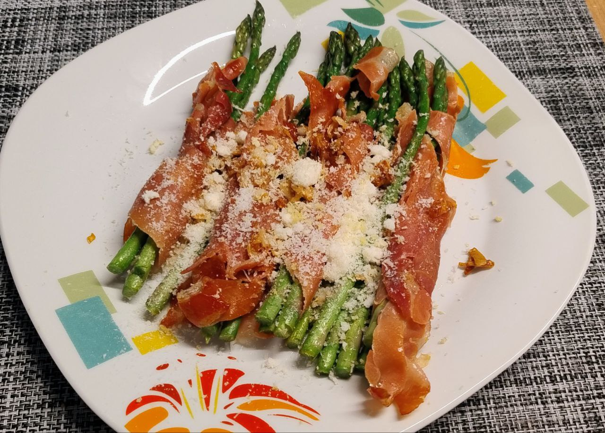

1.  **Prepara los espárragos:** Lava los **espárragos verdes** y corta la parte leñosa del tallo. Sécalos bien con papel de cocina.

2.  **Envuelve los espárragos:** Toma una loncha de **jamón serrano** y envuelve cada espárrago desde la base hasta la punta (o cada 3 espárragos según el tamaño), de forma que quede bien sujeto.

3.  **Sofríe el ajo:** Pela los **dientes de ajo** y pícalos finamente. Calienta el **aceite de oliva** en una sartén grande a fuego medio. Añade el ajo picado y sofríelo durante 30 segundos, con cuidado de que no se queme.

4.  **Cocina los espárragos:** Coloca los espárragos envueltos en la sartén. Cocínalos a fuego medio-alto durante unos **6-8 minutos**, dándoles la vuelta ocasionalmente, hasta que el jamón esté crujiente y los espárragos estén tiernos pero aún con un toque crujiente.

5.  **Termina y sirve:** Retira los espárragos de la sartén. Distribúyelos en un plato de servir. Espolvorea generosamente con el **queso parmesano rallado** y la **ralladura de limón** por encima. Añade un poco de pimienta negra recién molida al gusto. Sirve inmediatamente.

---

