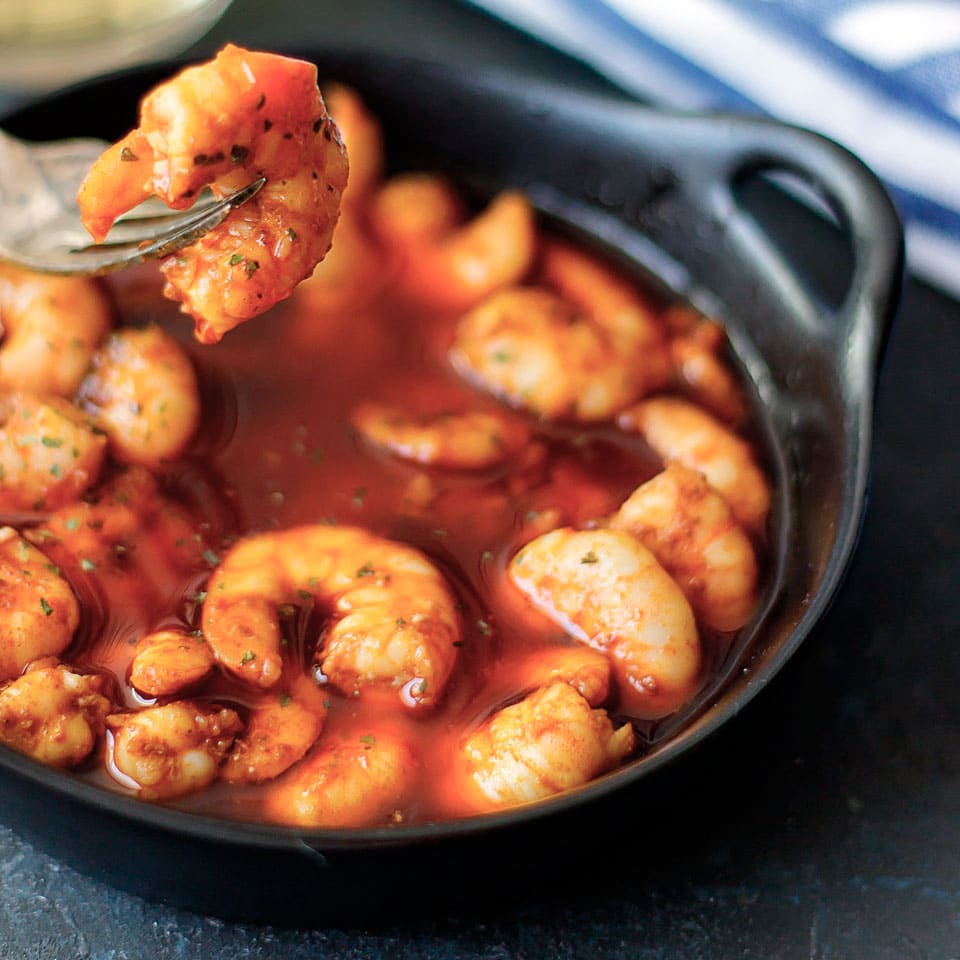

1. Pela las gambas o camarones y resérvalos.
2. Calienta el aceite a fuego medio.
3. Pela los dientes de ajo y córtalos en láminas finas.
4. Baja el fuego y agrega los ajos y las guindillas, friendo hasta que el ajo se dore.
5. Retira la sartén del fuego y añade una cucharadita de pimentón, removiendo para evitar que se queme.
6. Añade las gambas y deja que se cocinen con el calor residual.
7. Si usas camarones, cocínalos durante un minuto o dos más a fuego bajo hasta que cambien de color.
8. Sirve en pequeños platos de barro y disfruta inmediatamente.

---

_Adaptación de [Pequerecetas](https://www.pequerecetas.com/receta/gambas-al-pil-pil/)._

