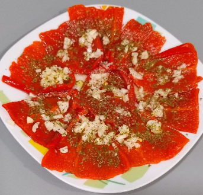

1. **Preparar el ajo y el perejil:** Pica finamente el ajo y corta el perejil en trozos pequeños.

2. **Colocar los pimientos:** Coloca los pimientos del piquillo escurridos en un plato de servir.

3. **Sazonar:** Espolvorea el ajo picado y el perejil sobre los pimientos de manera uniforme.

4. **Aliñar con aceite de oliva:** Rocía generosamente el aceite de oliva sobre los pimientos, asegurándote de que cada pimiento quede bien cubierto. Agrega sal al gusto.

5. **Marinar y servir:** Deja reposar los pimientos durante unos 10-15 minutos para que los sabores se mezclen. Sirve a temperatura ambiente como tapa o acompañante.

---

