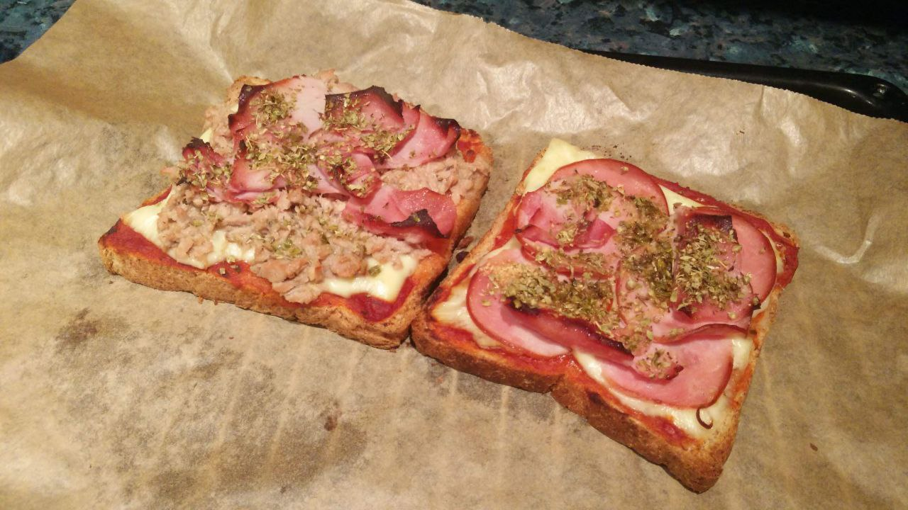

1.  **Prepara el pan:** Si lo deseas, tuesta ligeramente las **rebanadas de pan de molde** en una tostadora o en la freidora de aire durante 1-2 minutos. Esto evitará que se ablanden demasiado con los ingredientes.

2.  **Monta la tosta-pizza:** Sobre cada rebanada de pan, extiende una capa fina de **salsa de tomate**.

3.  **Añade los ingredientes:** Coloca tus **ingredientes extra** favoritos sobre la salsa de tomate.

4.  **Cubre con queso:** Espolvorea una cantidad generosa de **queso mozzarella rallado** sobre los ingredientes.

5.  **Hornea o cocina:**
    * **En el horno:** Hornea a 200°C con grill durante 5-7 minutos, o hasta que el queso se derrita y se dore.
    * **En la freidora de aire:** Cocina a 180°C durante 5-6 minutos, o hasta que el queso esté derretido.
    * **En el microondas:** Calienta durante 1-2 minutos a máxima potencia. El queso se derretirá, pero no se dorará.

6.  **Sirve:** Retira del horno o freidora y espolvorea un poco de **orégano seco** por encima. Sirve inmediatamente mientras el queso esté fundido.

---

