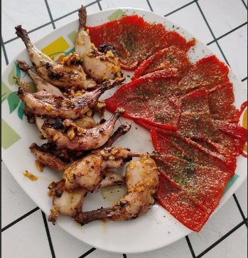

1. **Hacer el majao (pasta de ajo):** En un mortero, machaca el ajo con una pizca de sal hasta formar una pasta suave. Opcionalmente, agrega el pimentón y mezcla bien.
2. **Preparar las codornices:** Limpia las codornices y sazónalas con sal y pimienta. Si prefieres, puedes marinarlas con el majao durante una o dos horas para potenciar el sabor.
3. **Cocinar las codornices:** Calienta una buena cantidad de aceite de oliva en una sartén grande a fuego medio. Una vez caliente, dora las codornices por todos los lados.
4. **Añadir el majao:** (si no se ha marinado) Una vez que las codornices estén doradas, agrega el majao (pasta de ajo) a la sartén, mezclándolo bien con las codornices. Deja cocinar unos minutos hasta que los sabores se mezclen bien.
5. **Desglasar la sartén:** Agrega un chorrito de vino blanco o caldo a la sartén para desglasar, raspando los restos pegados al fondo. Deja que se cocine durante unos 10-15 minutos hasta que las codornices estén bien cocidas y tiernas.
6. **Adornar y servir:** Espolvorea perejil fresco picado por encima para adornar. Sirve con un acompañamiento de arroz, papas o verduras.

---

_Adaptación de [Cookpad](https://cookpad.com/es/recetas/16774991-codorniz-a-la-plancha-con-su-majado)_

