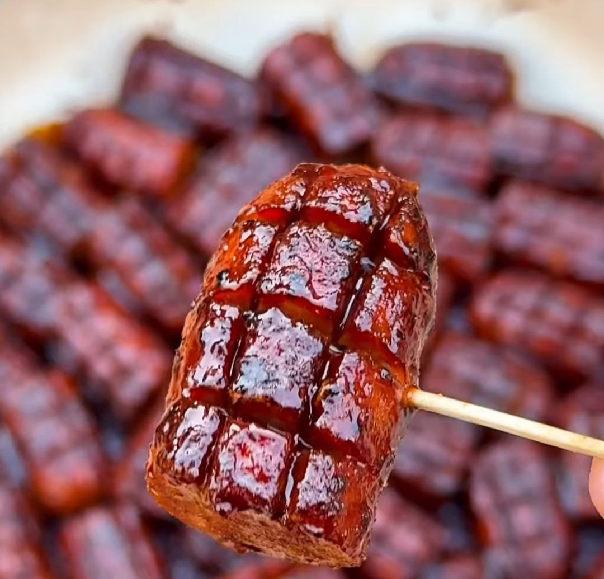

1. Precalienta el ahumador a 135 °C (275 °F).
2. Haz cortes en los perritos calientes a lo largo y a lo ancho para que parezcan colas de serpiente.
3. Úntalos con mostaza para que actúe como aglutinante del condimento.
4. En un bol pequeño, mezcla el pimentón ahumado, la cebolla en polvo, el ajo en polvo y los chiles molidos.
5. Cubre bien los perritos con esta mezcla de especias.
6. Colócalos en el ahumador durante unos 20 minutos, hasta que los cortes se abran.
7. Sácalos y córtalos en tercios. Coloca los trozos en una sartén de hierro fundido.
8. Cubre generosamente con la salsa barbacoa de azúcar moreno y nogal.
9. Devuelve la sartén al ahumador a 150 °C (300 °F) durante unos 30 minutos, o hasta que la salsa se espese y se adhiera bien.
10. Retira del ahumador y deja reposar unos minutos antes de servir.

---

_Adaptación de [Instagram @thebkydpalate](https://www.instagram.com/reel/DJ4uaabx245/?utm_source=ig_web_copy_link)._

