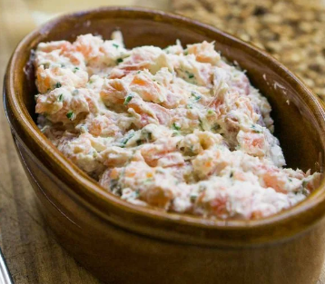

Para 6 porciones.  
También puedes hacer el plato completamente con salmón fresco o completamente con salmón ahumado cocinando la mitad de este.

1. Sazona el salmón por ambos lados con un poco de sal. Cocina al vapor en una canasta de vapor hasta que esté cocido, aproximadamente 8 minutos. Una vez cocido, retíralo del fuego y deja enfriar.
2. En un bol de tamaño mediano, machaca la mantequilla y el aceite de oliva con un tenedor hasta que quede muy suave. Esto es importante en este punto, de lo contrario, quedarán trozos grandes de mantequilla en los rillettes terminados.
3. Añade el jugo de limón, luego los cebollines picados y el salmón ahumado.
4. Retira la piel del salmón y desmenuza el salmón cocido sobre la mezcla, luego incorpora los trozos de salmón en la mezcla de rillettes junto con el chile en polvo. Prueba y añade más sal si lo deseas.
5. Coloca la mezcla en un recipiente para servir, cubre y refrigera por al menos dos horas. Deja que alcance la temperatura ambiente antes de servir.

Se puede servir con rebanadas tostadas de baguette, pero también quedaría delicioso con pan de centeno oscuro o sobre galletas saladas robustas.

## Conservación
Los rillettes se pueden hacer hasta dos días antes y refrigerar.  
También se pueden congelar, bien envueltos, durante hasta dos meses.

_Adaptación de [David Lebovitz](https://www.davidlebovitz.com/salmon-rillette/)._

