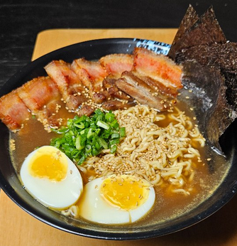

1.  **Prepara el caldo (Dashi y Caldo de Huesos):**
    * Limpia y escalda los **huesos de pollo/cerdo** en agua hirviendo durante 5 minutos para eliminar impurezas. Enjuágalos y colócalos en una olla grande con 3-4 litros de agua fría.
    * Lleva a ebullición y luego reduce el fuego al mínimo. Añade las **cebolletas**, el **jengibre** y los **dientes de ajo**.
    * Cocina a fuego lento durante un mínimo de **3-4 horas** (cuanto más tiempo, más sabor). Retira los huesos y los vegetales. Cuela el caldo para que quede limpio.

2.  **Prepara el Tare (la salsa base):**
    * En un cazo pequeño, calienta la **salsa de soja**, el **mirin** y el **sake**. Cocina a fuego muy lento durante 2-3 minutos para evaporar el alcohol. Este es el concentrado de sabor de tu ramen.

3.  **Prepara los toppings (opcionales pero recomendados):**
    * **Chashu:** Brasea la panceta de cerdo en una salsa dulce de soja hasta que esté muy tierna. Córtala en rodajas finas para servir.
    * **Ajitsuke Tamago:** Hierve huevos durante 6-7 minutos, pélalos y marínalos en una mezcla de salsa de soja, mirin y agua durante al menos 1-2 horas.
    * Corta el resto de los toppings como la **alga nori** en láminas, el **menma** y la parte verde de las **cebolletas** en rodajas finas.

4.  **Monta el Ramen:**
    * Cuece los **fideos de ramen** según las instrucciones del paquete. Es importante que el resto del plato esté listo, ya que los fideos se ablandan rápidamente.
    * Calienta el caldo y el tare. En un bol, añade 2-3 cucharadas del **tare**.
    * Vierte un cucharón de caldo caliente y mezcla bien.
    * Añade los fideos cocidos y escurridos.
    * Coloca los toppings de forma decorativa por encima, incluyendo el **Chashu**, el **Ajitsuke Tamago**, las **cebolletas**, el **alga nori** y el **menma**.

5.  **Sirve:** Sirve inmediatamente, añadiendo un chorrito de aceite de sésamo y unas **semillas de sésamo** al gusto.

---

_Adaptado de [Instagram @pisu.cocina](https://www.instagram.com/reel/DKM0SbCA9bf/)._

