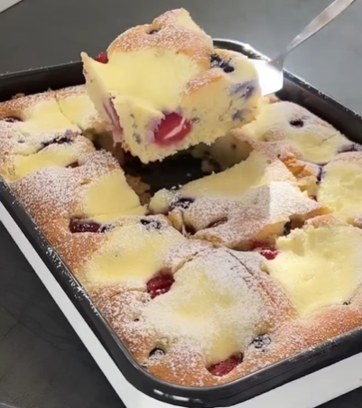

1. Mezcla la harina y la levadura en polvo y reserva.
2. Bate dos huevos, el azúcar y la vainilla durante 2-3 minutos hasta que estén suaves y esponjosos. Agrega el aceite y la leche, y mezcla bien. Incorpora la mezcla de harina y revuelve hasta que esté bien combinado.
3. Engrasa una bandeja para hornear (30x40 cm), extiende la masa de manera uniforme y coloca las frutas por encima.
4. En un bol aparte, mezcla la cuajada, el azúcar y un huevo hasta que quede suave. Usa una cuchara para distribuir esta mezcla sobre el pastel.
5. Hornea el pastel en un horno precalentado a 180°C (350°F), con calor arriba y abajo, durante unos 40 minutos.

---

_Adaptación de [Instagram @recetasfitss](https://www.instagram.com/p/Cxbdoulvssv/?utm_source=ig_web_copy_link&igsh=MzRlODBiNWFlZA==)._

