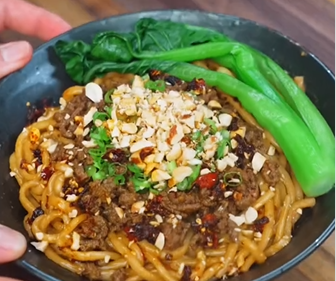

1.  **Cuece los fideos:** Cuece los **fideos** hasta que estén al dente. Antes de escurrirlos, reserva un poco del **agua de la cocción**.

2.  **Prepara la salsa:** En un bol, combina la **mantequilla de cacahuete**, la **salsa de soja**, el **azúcar**, los **dientes de ajo picados**, la **pimienta de Sichuan** y la **sriracha**. Añade un chorrito del **agua de los fideos** que reservaste y mezcla bien hasta que la salsa esté suave.

3.  **Dora la ternera:** Calienta un poco de aceite en tu sartén. Añade la **carne de ternera picada** y dórala durante unos 3 minutos a fuego medio-alto.

4.  **Termina la ternera:** Añade **salsa de soja**, **azúcar** y **aceite de guindilla** a la carne. Continúa cocinando por otros 3 minutos, removiendo ocasionalmente.

5.  **Mezcla los fideos:** En un bol grande, combina los **fideos** cocidos con la **salsa** preparada. Mezcla bien hasta que los fideos queden uniformemente cubiertos.

6.  **Sirve:** Transfiere los fideos a un cuenco de servir y cúbrelos con la **carne de ternera cocinada**.

7.  **Decora y disfruta:** Opcionalmente, puedes decorar con **verduras al vapor**, **cebolletas**, **cacahuetes** y más **aceite de guindilla** al gusto.

---

_De [Instagram @i.am.never.full](https://www.instagram.com/reel/DMDdukuu5rH/?utm_source=ig_web_copy_link)._

