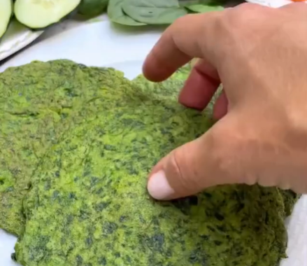

1. Chop the spinach into very small pieces.
2. Mix the spinach with the rest of the ingredients.
3. Heat a pan with a few drops of olive oil.
4. Spoon a bit of the mixture onto the pan and shape it into a round form with the back of a spoon.
5. Cook on both sides until golden brown.

You can fill them with your favourite toppings (e.g., cucumber, arugula, smoked salmon, and light mayonnaise).

---

_From [Instagram @recetas_saludablesfit](https://www.instagram.com/p/Cin0TaWPHXE/?utm_source=ig_web_copy_link&igsh=MzRlODBiNWFlZA==)._

