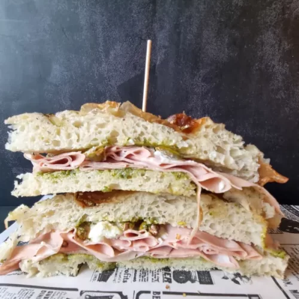

1. Tuesta la focaccia a 180°C (350°F) durante 10-12 minutos (con ventilador). Corta la focaccia por la mitad horizontalmente (esto se puede hacer antes o después de tostarla).
2. Opcionalmente, rocía aceite de oliva virgen extra en ambas mitades.
3. Coloca las rebanadas de mortadela en una mitad de la focaccia hasta cubrirla completamente.
4. Corta la burrata y extiende una capa uniforme sobre la mortadela.
5. Extiende una capa de pesto sobre la burrata.
6. Cierra la focaccia con la otra mitad. Sírvela cortada por la mitad o en tres trozos.

## Relleno alternativo:
- Tomate fresco
- Pechuga de pollo fiambre
- Queso mozzarella
- Guacamole
  
---

_Adaptación de [Pizza en Casa Pro](https://pizzaencasapro.com/receta/bocata-de-focaccia-rellena/)._

