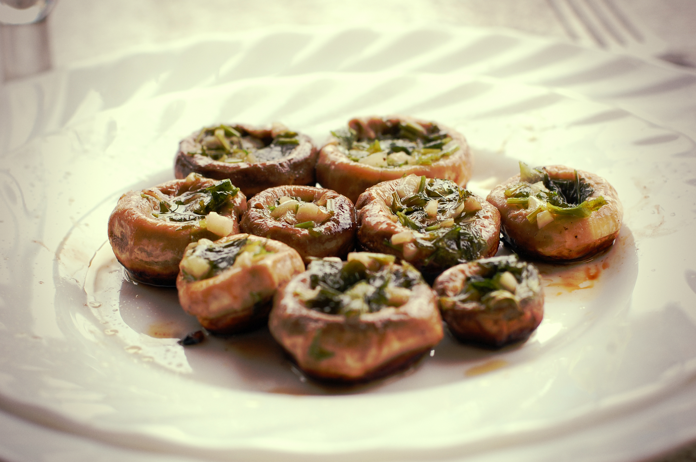

1. Remove the stems and thoroughly wash the mushrooms to eliminate any dirt or sand. It's important not to remove the skin in this case, as they could burn (especially if cooked in a pan).
2. Take a handful of parsley and as many garlic cloves as you think necessary, depending on how many mushrooms you want to prepare.
3. Finely chop the garlic and parsley, and let them marinate with a good drizzle of olive oil. The garlic and parsley should be well coated in oil, but not soaked. They should have a soft appearance.
4. In a pan, heat it with a small amount of oil and, without filling the mushrooms yet, quickly sear them to brown them. Remove them from the pan, fill them, and you can return them to the pan for a few more minutes, being careful not to burn the bottoms.
5. Plate them up, and they're ready to serve!

If you prefer to bake them, preheat the oven or air-fryer to 200°C (390°F) and bake them for about 15 minutes.

---

_From [Mis recetas veganas](https://recetasveganas.net/recipes/champinones-rellenos-de-ajo-y-perejil)._

