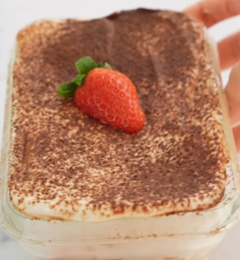

1. **Preparar el bizcocho:** En un bol, mezcla el huevo, el yogur, la harina de avena, la levadura en polvo y el edulcorante hasta que quede suave.
Engrasa ligeramente un pequeño recipiente apto para microondas o una taza y vierte la masa.
Microondas a máxima potencia durante 3 minutos, revisando a los 2 minutos y agregando intervalos de 15 segundos si es necesario hasta que se cocine.
Deja enfriar el bizcocho durante unos minutos y luego córtalo en capas finas.

2. **Empapar las capas:** Sumerge cada capa de bizcocho en café enfriado (y licor opcional como brandy o coñac), dejando que se empape ligeramente sin quedar demasiado mojado.

3. **Montar el tiramisú:** En un recipiente grande o en copas individuales, coloca las capas de bizcocho empapado en café y la crema de queso/yogur alternándolas.
Continúa montando hasta que se acaben los ingredientes, terminando con una capa de crema en la parte superior.

4. **Decorar:** Espolvorea cacao en polvo sobre la capa superior para un acabado clásico de tiramisú.

5. **Enfriar:** Refrigera durante al menos 1 hora antes de servir para que los sabores se fusionen.

---

_Adaptación de [Instagram @annappleaday_](https://www.instagram.com/reel/CompRAejeHl/?utm_source=ig_web_copy_link&igsh=MzRlODBiNWFlZA==)._

