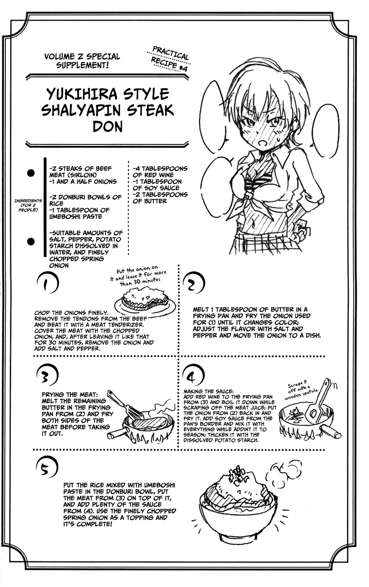

Para preparar el bol de arroz, sigue la receta de [Gohan](../gohan_rice).

## Cómo cocinar
1. Pica finamente las cebollas.

2. (Opcional) Pica el ajo y mézclalo con la cebolla.
3. Retira los tendones de la carne y golpéala con un ablandador de carne hasta que quede lo más plana posible.
4. Cubre la carne con las cebollas picadas por ambos lados y deja reposar durante 30 minutos o más.
5. Retira la cebolla y sazona el filete con sal y pimienta.
6. Derrite 1 cucharada de mantequilla en una sartén y fríe la cebolla hasta que cambie de color.
7. Ajusta el sabor con sal y pimienta, luego mueve la cebolla a un plato.
8. Cocina el filete a tu gusto (la mayoría prefieren término medio): Derrite la mantequilla restante en la sartén y fríe ambos lados de la carne antes de retirarla.

## Preparando la salsa

1. Agrega el vino tinto a la sartén usada para la carne para desglasarla.
2. Hierve el vino mientras raspas los jugos de la carne con una espátula de madera.
3. Vuelve a poner la cebolla en la sartén y fríela.
4. Añade la salsa de soja por el borde de la sartén y mezcla todo mientras lo agregas para sazonar.
5. (Opcional) Espesa la salsa con almidón de patata disuelto.

## Montando el plato
1. Coloca el arroz en un bol para donburi.
2. (Opcional) Mezcla el arroz con la pasta de umeboshi (ciruela encurtida) en el bol.
3. Coloca el filete encima y agrega mucha salsa.
4. Decora con cebollín finamente picado (cebollitas).





---

_De [Shokugeki no Soma](https://shokugekinosoma.fandom.com/wiki/Chaliapin_Steak_Don)._

