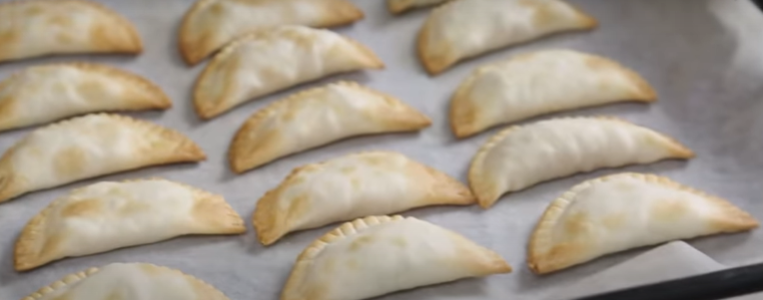

1. Preheat the oven to 200°C (390°F).
2. Peel the apples, cut them into small cubes, and sauté them in a pan over medium heat for 15 minutes, stirring occasionally with the sugar (optional) and butter until they are slightly caramelized. Add the cinnamon and mix. Let it cool.
3. Fill the pastry discs with the apple mixture and fold them, sealing the edges with the help of a fork.
4. Place the turnovers on a baking sheet and optionally brush them with a little sunflower oil or egg using a pastry brush.
5. Bake for 10-12 minutes until they are lightly golden.
6. Once cooled, sprinkle with powdered sugar (optional).
7. 
---

_Adaptation from [Nestle Cocina](https://www.nestlecocina.es/receta/empanadillas-de-manzana-con-canela)._

