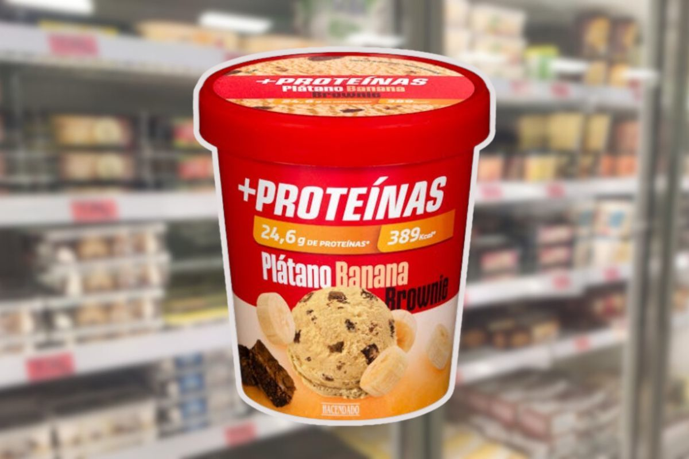

1. Blend the bananas with the yogurt and peanut butter in a blender.
2. Place in the freezer for 30 minutes.
3. Serve and add the chopped chocolate pieces.

---

_Adaptation from [Instagram @miguelnaarfit](https://www.instagram.com/reel/C8Fg_5NCNkG/?utm_source=ig_web_copy_link&igsh=MzRlODBiNWFlZA==)._

