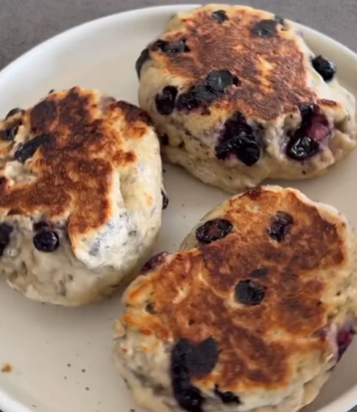

1. Mash the bananas, add the flour and baking powder, and knead well. 
2. Add the blueberries and continue kneading until you get a moldable dough.
3. Divide the dough into 4 equal pieces, flatten the balls, and cook them in a covered pan over medium-low heat for 4 minutes on each side.

---

_From [Instagram @recetassaludables_faciles](https://www.instagram.com/p/C7aMwlQulgb/?utm_source=ig_web_copy_link&igsh=MzRlODBiNWFlZA==)._

